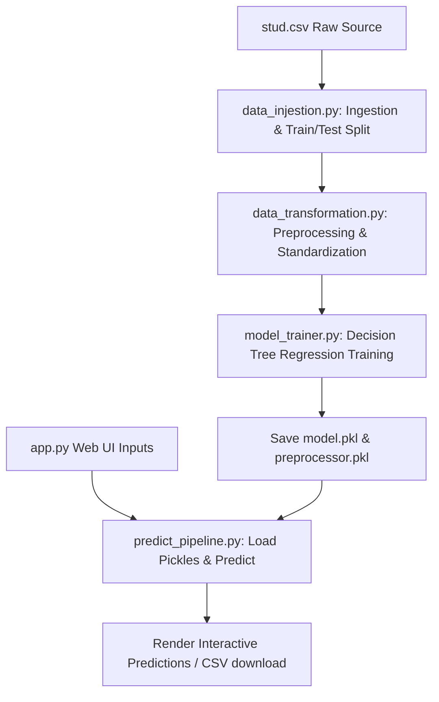

# Student Performance Prediction & Analysis

A production-ready data science web application that analyzes and predicts students' total performance scores based on demographic and academic features. Built with Streamlit, Scikit-learn, and Pandas, the project follows modular software engineering best practices with segregated data ingestion, preprocessing, and model training pipelines.

---

## 🚀 Key Features

1. **Interactive Score Predictor**: Input individual student details (gender, ethnicity, parental education, lunch type, prep course, and subject scores) to get real-time total score predictions and benchmark comparisons.
2. **Batch CSV Inference**: Upload a CSV file containing multiple student profiles, run bulk predictions, view results in an interactive table, and export predictions as a downloadable CSV.
3. **EDA Dashboard**: Instantly visualize dataset distributions, scatter charts of subject correlations, and average score breakdowns grouped by demographics (parental education, lunch type, prep course).
4. **On-Demand Retraining**: Trigger the complete machine learning pipeline (Data Ingestion -> Transformation -> Decision Tree Model Training -> Evaluation -> Serialization) directly from the Web UI.

---

## 📂 Project Folder Structure

```text
SML_Project/
│
├── app.py                      # Streamlit Web Application (UI & Dashboards)
├── run_data_ingestion.py       # Standalone ingestion launcher script
├── setup.py                    # Package installer script for editable installs
├── requirements.txt            # Project dependencies
├── data_preprocessing.ipynb    # Jupyter notebook for exploratory analysis
├── README.md                   # Project documentation & instructions
│
├── src/                        # Core Application Source Code
│   ├── logger.py               # Custom log handler
│   ├── custom_exception.py     # Custom error trace wrapper
│   ├── utils.py                # Database and file helper utilities
│   │
│   ├── components/             # Machine Learning Pipeline Blocks
│   │   ├── data_injestion.py   # Loads raw data and splits train/test sets
│   │   ├── data_transformation.py # Handles missing values & scales features
│   │   └── model_trainer.py    # Trains and evaluates Decision Tree Regressor
│   │
│   └── pipeline/               # Pipeline Execution Scripts
│       ├── trainer_pipeline.py # Model training initiator
│       └── predict_pipeline.py # Model loading and prediction initiator
│
├── artifacts/                  # Created during pipeline runs
│   ├── raw_data.csv            # Combined dataset with targets
│   ├── train_data.csv          # Training split
│   ├── test_data.csv           # Testing split
│   ├── preprocessor.pkl        # Serialized ColumnTransformer preprocessing object
│   └── model.pkl               # Serialized Decision Tree model object
│
└── tests/                      # Testing Scripts
    └── run_data_ingestion_test.py
```

---

## 🛠️ Installation & Setup

Follow these steps to set up and run the project locally.

### 1. Prerequisite Checklist
- **Python**: Ensure you have Python 3.8+ installed.
- **Git**: Installed for version control.

### 2. Navigate to Project Root
Open your terminal (PowerShell on Windows, bash on macOS/Linux) and navigate to the project directory:
```powershell
cd "E:\Data_Science\ML Projects\SML_Project"
```

### 3. Create & Activate Virtual Environment
```powershell
# Create venv
python -m venv myenv

# Activate on Windows (PowerShell):
.\myenv\Scripts\Activate.ps1

# Activate on macOS/Linux:
source myenv/bin/activate
```

### 4. Install Dependencies
Install all required libraries, including Streamlit, Scikit-learn, and the local package in editable mode:
```powershell
pip install -r requirements.txt
```

### 5. Run the Streamlit Application
Launch the web-based interactive analytics app:
```powershell
streamlit run app.py
```
Open **`http://localhost:8501`** in your browser to view the application.

---

## 📊 Pipeline Architecture



### Ingestion Details:
- **Missing Value Handling**: Numerical columns are imputed with the `median` value; categorical columns are imputed with `most_frequent` value (Mode).
- **Scale Transformation**: Standardizes numerical fields (`StandardScaler`) and applies one-hot encoding (`OneHotEncoder`) to categorical attributes.
- **Model**: Decision Tree Regressor model, customized for predicting total scores based on individual performance factors.

---

## 📈 Future Enhancements
- **Multi-Model Comparison**: Add model comparison indicators (R2 score, RMSE) for multiple algorithms (XGBoost, Random Forest, Linear Regression).
- **Database Integration**: Connect the ingestion pipeline directly to a SQL database instead of static CSV files.
- **Model Monitoring**: Log real-time model prediction drift and trigger automated alerts.
